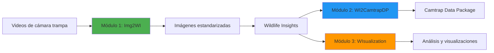

# CamTrapFlow (CTF)

**Suite integrada para el procesamiento, estandarización y análisis de datos de fototrampeo**

[]()
[](https://www.python.org/downloads/)
[]()

---

## 📋 Tabla de contenidos

- [Descripción](#-descripción)
- [Módulos incluidos](#-módulos-incluidos)
- [Arquitectura](#-arquitectura-general)
- [Flujo de trabajo](#-flujo-de-trabajo-típico)
- [Requisitos](#-requisitos)
- [Documentación](#-documentación)
- [Política de datos](#-política-de-datos)
- [Alcance institucional](#-alcance-institucional)
- [Autoría](#-autoría)
- [Cómo Citar](#-cómo-citar)
- [Licencia](#-licencia)

---

## 🔬 Descripción

CamTrapFlow es un ecosistema de herramientas desarrollado para el **Instituto de Investigación de Recursos Biológicos Alexander von Humboldt – Red OTUS**, que cubre el flujo completo de trabajo de datos de cámaras trampa, desde la generación de imágenes a partir de video, la estandarización científica de la información, el análisis estadístico y la visualización, hasta la gestión unificada mediante una interfaz gráfica central.

### ✨ Características principales

- 🎬 Conversión automatizada de videos a imágenes estandarizadas
- 📦 Conversión a estándar **Camtrap Data Package (v1.0.2)**
- 📊 Análisis estadístico y visualización ecológica avanzada
- 🖥️ Interfaz gráfica unificada para gestión centralizada
- 🔄 Interoperabilidad con **Wildlife Insights**, **GBIF** y **SIB Colombia**
- ✅ Cumplimiento de estándares científicos internacionales

---

## 📦 Módulos incluidos

| Módulo | Nombre | Descripción | Documentación |
|--------|--------|-------------|---------------|
| **Módulo 1** | **Img2WI** | Convierte videos de cámaras trampa en secuencias de imágenes organizadas y estandarizadas, listas para análisis o carga en Wildlife Insights. | [📖 Ver docs](Modulo1_Img2WI/README.md) |
| **Módulo 2** | **WI2CamtrapDP** | Convierte exportaciones de Wildlife Insights al estándar científico **Camtrap Data Package (v1.0.2)**, listo para publicación en plataformas como GBIF y SIB Colombia. | [📖 Ver docs](Modulo2_WI2CamtrapDP/README.md) |
| **Módulo 3** | **WIsualization** | Aplicación gráfica para análisis y visualización estadística: curvas de acumulación, patrones de actividad horaria, presencia/ausencia, mapas y métricas ecológicas. | [📖 Ver docs](Modulo3_WIsualization/README.md) |
| **Launcher** | **CamTrapFlow Launcher** | Interfaz gráfica centralizada que permite ejecutar los tres módulos anteriores desde un único punto de acceso. | [📖 Ver docs](Launcher/README.md) |

---

## 🧩 Arquitectura general

```text
CamTrapFlow/
│
├── Launcher/              → CamTrapFlow Launcher (GUI principal)
│   ├── README.md
│   └── ...
│
├── Modulo1_Img2WI/        → Extracción de imágenes desde video
│   ├── README.md
│   └── ...
│
├── Modulo2_WI2CamtrapDP/  → Conversión a Camtrap-DP
│   ├── README.md
│   └── ...
│
├── Modulo3_WIsualization/ → Visualización y análisis
│   ├── README.md
│   └── ...
│
├── README.md              → Este archivo
├── .gitignore
└── LICENSE
```

> **Nota:** Cada carpeta contiene su propio `README.md` con la documentación técnica detallada del módulo correspondiente, incluyendo requisitos, instalación, ejecución y flujo de trabajo específico.

---

## 🔁 Flujo de trabajo típico



### Paso a paso

1. **🎬 Procesamiento de video (Img2WI)**  
   Se convierten los videos provenientes de cámaras trampa en imágenes individuales, organizadas y con nomenclatura estandarizada.

2. **📤 Carga en Wildlife Insights**  
   Las imágenes generadas se cargan en la plataforma Wildlife Insights para su clasificación taxonómica y validación.

3. **📦 Estandarización científica (WI2CamtrapDP)** o **📊 Análisis y visualización (WIsualization)**  
   A partir de los datos descargados de Wildlife Insights, se pueden realizar dos procesos independientes:
   
   - **Módulo 2:** Convierte la exportación de Wildlife Insights al estándar Camtrap Data Package, garantizando interoperabilidad y calidad científica para publicación en GBIF y SIB Colombia.
   
   - **Módulo 3:** Realiza análisis estadísticos y visualizaciones que permiten la exploración ecológica de los datos: curvas de acumulación, patrones de actividad, mapas y métricas.

4. **🚀 Gestión unificada (CamTrapFlow Launcher)**  
   Todos los módulos pueden ejecutarse desde una sola aplicación gráfica, simplificando la operación para usuarios finales.

---

## 🖥️ Requisitos

### Para usuarios finales

- **Sistema Operativo:** Windows 10/11 (64-bit)
- **Espacio en disco:** Mínimo 2 GB libres
- **Memoria RAM:** Mínimo 4 GB (recomendado 8 GB)
- **No se requiere Python instalado** (uso mediante ejecutables `.exe`)

### Para desarrollo

- **Python:** 3.10+ (Img2WI y WI2CamtrapDP) | 3.12+ (WIsualization)
- **Git:** Para control de versiones
- **IDE recomendado:** VS Code, PyCharm o similar
- **Dependencias:** Ver `requirements.txt` en cada módulo

> **Nota:** Cada módulo define en su documentación interna sus dependencias exactas.

---

## 📚 Documentación

Para la documentación completa de cada componente consulte:

- 🚀 [**Launcher/README.md**](Launcher/README.md) → Documentación del CamTrapFlow Launcher
- 🎬 [**Modulo1_Img2WI/README.md**](Modulo1_Img2WI/README.md) → Documentación del módulo Img2WI
- 📦 [**Modulo2_WI2CamtrapDP/README.md**](Modulo2_WI2CamtrapDP/README.md) → Documentación del módulo WI2CamtrapDP
- 📊 [**Modulo3_WIsualization/README.md**](Modulo3_WIsualization/README.md) → Documentación del módulo WIsualization

### Recursos adicionales

- [Estándar Camtrap Data Package](https://tdwg.github.io/camtrap-dp/)
- [Wildlife Insights Platform](https://wildlifeinsights.org/)
- [GBIF Data Standards](https://www.gbif.org/standards)

---

## 📁 Política de datos

Este repositorio:

- ❌ **NO versiona** datos sensibles
- ❌ **NO versiona** datasets reales de campo
- ❌ **NO versiona** salidas intermedias de proyectos productivos
- ❌ **NO versiona** resultados pesados

Cada módulo indica en su `README`:

- ✅ Dónde deben ubicarse los datos de entrada
- ✅ Qué carpetas se usan para salidas locales
- ✅ Qué información no debe subirse a Git

---

## 🎯 Alcance institucional

CamTrapFlow constituye una plataforma técnica diseñada para:

- ✅ Estandarizar flujos de datos de fototrampeo en Colombia
- ✅ Facilitar la publicación científica bajo estándares abiertos
- ✅ Garantizar trazabilidad, reproducibilidad y calidad de los datos
- ✅ Transferir capacidades técnicas a equipos de investigación y monitoreo
- ✅ Unificar herramientas dispersas en un solo ecosistema coherente

---

## 🤝 Contribuciones

Este proyecto es parte del desarrollo de software para el Instituto Humboldt - Contrato 25_064.

---

# 👥 Autoría

**Desarrollo principal:**  
Cristian C. Acevedo

**Coordinación científica:**  
Angélica Diaz-Pulido

**Institución:**  
Instituto de Investigación de Recursos Biológicos Alexander von Humboldt – Red OTUS

**Proyecto:**  
Contrato 25-064 
Desarrollo de Software CamTrapFlow (CTF) y Dashboards

**Año:** 2025

---
## 📚 Cómo Citar

Si utilizas esta herramienta en tu investigación, por favor cítala como:

Acevedo, C. C., & Diaz-Pulido, A. (2025). *CamTrapFlow (CTF) - Suite integrada para el procesamiento, estandarización y análisis de datos de fototrampe (v1.0.0)* [Software]. Red OTUS, Instituto de Investigación de Recursos Biológicos Alexander von Humboldt. https://github.com/PEM-Humboldt/cam-trap-flow


## 📄 Licencia

Este proyecto se distribuye bajo la licencia definida en el archivo [LICENSE](LICENSE).

---

## 🧭 Nota final

> **CamTrapFlow no es un conjunto de scripts aislados.**  
> Es una plataforma técnica integral para la gestión, estandarización y análisis de datos de biodiversidad generados por cámaras trampa, alineada con estándares internacionales y con las necesidades operativas del Instituto Humboldt y la Red OTUS.

---

<div align="center">
  <em>Instituto de Investigación de Recursos Biológicos Alexander von Humboldt</em><br>
  <strong>Comprometidos con la conservación y el conocimiento de la biodiversidad colombiana</strong>
</div>
